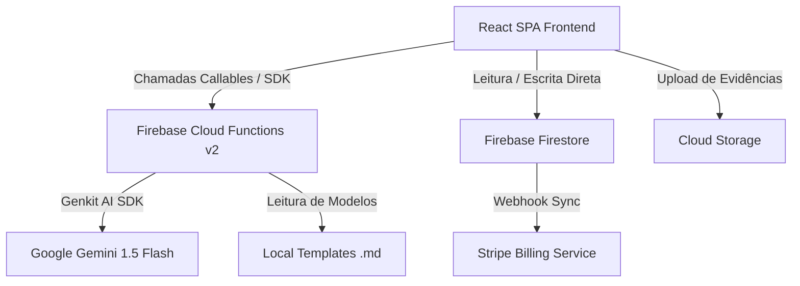

# DPO Fast - SaaS para Adequação à LGPD

O **DPO Fast** é um Micro-SaaS (Software as a Service) premium projetado para simplificar, automatizar e gerenciar todo o ciclo de adequação de pequenas e médias empresas à Lei Geral de Proteção de Dados (LGPD) no Brasil.

A plataforma utiliza um sistema multiagente inteligente com **Genkit AI (Gemini)** para diagnosticar riscos, recomendar planos de ação, auditar evidências de tarefas e gerar documentos de conformidade personalizados a partir de mapeamentos de processos.

---

## ⚙️ Arquitetura Geral do Sistema

O sistema é construído sobre uma arquitetura moderna e escalável dividida em três pilares principais:



### 1. Frontend (Interface do Usuário)
- **Tecnologias**: React, TypeScript, Vite, Tailwind CSS, Lucide Icons.
- **Design System**: Interface com estética premium em Dark Mode, transições fluidas e micro-animações dinâmicas para engajamento do usuário.
- **Segurança**: Isolamento multi-tenant por rotas autenticadas e leituras/escritas baseadas estritamente no UID do usuário via Firebase Auth.

### 2. Backend (Cloud Functions & Genkit Multi-Agentes)
- **Tecnologias**: Node.js, TypeScript, Genkit AI Core.
- **Orquestração de IA**:
  - **Agente de Diagnóstico (`discovery`)**: Analisa o escopo da empresa e determina o nível inicial de maturidade de proteção de dados.
  - **Agente de Sugestão (`suggestion`)**: Analisa as não-conformidades e gera um plano de ação prioritário.
  - **Agente de Redação (`drafting`)**: Rascunha termos e avisos de privacidade customizados para a empresa.
  - **Agente Consultor (`consultant`)**: Um assistente virtual chat (DPO Assistant) para esclarecer dúvidas jurídicas de conformidade.
  - **Gerador Automatizado (`generateDocumentFromTemplate`)**: Carrega templates jurídicos estruturados `.md` da pasta local `lib/templates`, combina com os dados de mapeamento do setor da empresa e invoca a inteligência artificial para produzir a documentação final customizada.

### 3. Banco de Dados & Infraestrutura (Firebase)
- **Firestore Database**: Modelagem focada em subcoleções e isolamento de tenants.
- **Cloud Storage**: Armazenamento seguro de evidências, relatórios gerados e arquivos enviados.
- **Hosting**: CDN global do Firebase com cabeçalhos HTTP defensivos (HSTS, CSP, X-Frame-Options, X-Content-Type-Options) habilitados contra XSS e Clickjacking.

---

## 💼 Modelo de Planos & Paywall (Atualizado)

O sistema opera com três níveis oficiais de plano, com regras rígidas de acesso e bypass:

| Plano | Acesso | Validação Stripe | Geração por IA |
| :--- | :--- | :--- | :--- |
| **FREE / BASICO** | Apenas leitura e preenchimento inicial. | Isento | Desativado (UI com Cadeado) |
| **PRO** | Acesso completo às ferramentas e geração de documentos. | **Requer status `active` ou `trialing`** | Ativo (Geração via Cloud Function) |
| **Personalité** | Acesso completo e serviços de consultoria física. | **Bypass no Stripe** (Contrato manual) | Liberado direto pelo status do Firestore |

---

## 🛠️ O que foi Implementado (Resumo do Progresso)

### 1. Sistema Automatizado de Templates
- Criado o script utilitário de build ([copy-templates.js](file:///c:/Users/Solution/Documents/GitHub/DPO-FAST/functions/copy-templates.js)) para copiar automaticamente os templates markdown jurígenos locais para o diretório de compilação da Cloud Function, contornando a restrição de deploy de pastas ocultas (`.genkit/`).
- Atualizadas as resoluções de caminhos de leitura do sistema de arquivos para garantir execução idêntica no Emulador e na nuvem.

### 2. Feedback Visual de Mapeamento
- Painel interativo pós-mapeamento: exibe instantaneamente ao usuário a quantidade de gaps de conformidade encontrados, o status de conformidade do setor e a quantidade de processos restantes para a adequação corporativa total.

### 3. Ajustes de Condições de Corrida (Race Conditions)
- Ajustes no fluxo de redirecionamento pós-pagamento com Stripe, garantindo sincronia otimista enquanto o webhook de alteração de plano se propaga pelo Firestore.

### 4. Fortalecimento de Cabeçalhos de Segurança
- Configuração completa e consolidada de cabeçalhos de segurança (CSP, FrameGuard, NoSniff) no [firebase.json](file:///c:/Users/Solution/Documents/GitHub/DPO-FAST/firebase.json).

---

## 🚀 Como Executar o Projeto Localmente

### Pré-requisitos
- Node.js v20+
- Firebase CLI instalado globalmente (`npm install -g firebase-tools`)

### Passo a Passo

1. **Instalar dependências**:
   ```bash
   npm install
   npm --prefix functions install
   ```

2. **Compilar as Cloud Functions**:
   ```bash
   npm --prefix functions run build
   ```

3. **Iniciar o servidor de desenvolvimento do Frontend**:
   ```bash
   npm run dev
   ```

4. **Iniciar os Emuladores do Firebase (Opcional)**:
   ```bash
   firebase emulators:start
   ```

5. **Deploy das Functions para Produção**:
   ```bash
   npm --prefix functions run deploy
   ```

---

## ⚖️ Licença
MIT License - Desenvolvido para fins de adequação de privacidade e segurança da informação.
Para contato técnico, fale com a equipe de engenharia pelo e-mail `projetossolutiondev@gmail.com`.
